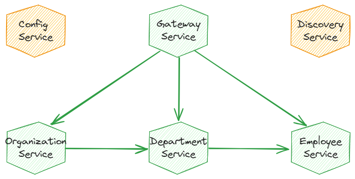

## employee-management
Sample Microservices with Spring Boot 3, Spring Cloud, FeignClient and Zipkin

> [!NOTE]
> To provide a clearer focus on the microservices architecture, some features, such as the database, services, and validation, have been omitted in this application and in-memory data is used.
<br/>

### Description

This project is created to demonstrate useful features of [Spring Cloud Project](https://spring.io/projects/spring-cloud) for building microservice-based architecture. By default, Spring Cloud Config Server stores the configuration data inside the Git repository. We will change that behavior by activating the native mode. In this mode, Spring Cloud Config Server reads property sources from the classpath.

<br/>

### Architecture

This microservices-based system consists of the following modules:
- **gateway-service** : acts as a proxy/gateway in our architecture
- **config-service** : uses Spring Cloud Config Server for running configuration server in the `native` mode
- **discovery-service** : uses Spring Cloud Netflix Eureka as an embedded discovery server
- **employee-service** : sample microservice that allows to perform CRUD operation on in-memory repository of employees
- **department-service** : sample microservice that allows to perform CRUD operation on in-memory repository of departments. Communicates with employee-service.
- **organization-service** : sample microservice that allows to perform CRUD operation on in-memory repository of organizations. Communicates with both employee-service and organization-service.

The microservices architecture is shown below:



<br/>


## Getting Started

> [!NOTE]
> The following apps should be installed before running the application:

- A command line app
- Docker Desktop
  <br/>

> [!TIP]
> For more information regarding the system requirements, etc. refer to the following pages: <br/>
> [Install on Mac](https://docs.docker.com/desktop/install/mac-install/)<br/>
> [Install on Windows](https://docs.docker.com/desktop/install/windows-install/)<br/>
> [Install on Linux](https://docs.docker.com/desktop/install/linux-install/)<br/>

<br/>


### Running the application

In order to run the application on local, follow these steps:

1. Run Docker desktop.

<br/>

2. Open command prompt window and clone the project from GitHub using the following command:

```shell
git clone https://github.com/yildizmy/employee-management.git
```
<br/>

3. Change the current directory to the project directory where the `docker-compose.yml` file located in:

```shell
cd employee-management
```
<br/>

4. Run the following command:

```shell
docker compose up --build
```

<br/>

5. After database container starts on Docker, open backend project in using `IntelliJ IDEA`. Then select `Java 17` version via `File > Project Structure > Project > SDK` menu and run the services in the following order:

> [!IMPORTANT]
> If _Lombok requires enabled annotation processing_ dialog appears at this stage, click _Enable annotation processing_ button.

- **config-service**
- **discovery-service**
- **gateway-service**
- other services (**employee-service**, **department-service**, **organization-service**)

<br/>

### Dependencies

* Spring Boot
* Spring Web
* Spring Security
* Spring Data JPA
* Lombok
* MapStruct
* PostgreSQL
* Flyway
* React
* Node.js
* Material UI

<br/>

### Documentation
[Spring Boot](https://docs.spring.io/spring-boot/docs/current/reference/htmlsingle/)<br/>
[Spring Security](https://docs.spring.io/spring-security/reference/index.html)<br/>
[Spring Data JPA](https://docs.spring.io/spring-data/jpa/docs/current/reference/html/)<br/>
[springdoc-openapi v2](https://springdoc.org/v2/)<br/>
[MapStruct](https://mapstruct.org/)<br/>
[JUnit 5](https://junit.org/junit5/docs/snapshot/user-guide/)<br/>
[Entity Relationship Diagram (ERD)](https://www.lucidchart.com/pages/er-diagrams)<br/>
[React](https://react.dev/)<br/>
[Material UI](https://mui.com/)<br/>
[Notistack](https://notistack.com/features/basic)<br/>
[Register of countries using the IBAN standard](https://www.iban.com/structure)<br/>

<br/>

### Version History

* v0.0.1 Initial Release

<br/>
<br/>
