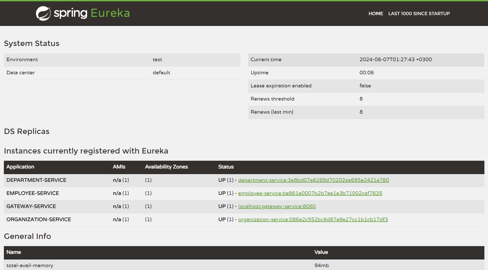

## How to test?

After starting the app, some test data is generated automatically.

 

### Open API (Swagger) UI

For Open API (Swagger) Documentation UI and the endpoints, open localhost:8060/swagger-ui.html after running the app.

 

### Postman Collection

The [Postman Collection](../postman/employee_management.postman_collection.json) shared in the resources can be modified and used
for testing the endpoints.

 

### API Endpoints

The following endpoints can be used in order to test services:

> [!NOTE]
> All URIs are relative to *http://localhost:8060*

 

| Class              | Method                                                                | HTTP request                        | Description                                      |
|--------------------|-----------------------------------------------------------------------|-------------------------------------|--------------------------------------------------|
| *EmployeeController* | [**add**](http://localhost:8060/employees/)                           | **POST** /employees/        | Adds a new employee                              |
| *EmployeeController* | [**findAll**](http://localhost:8060/employees)                        | **GET** /employees                  | Retrieves all employees                          |
| *EmployeeController* | [**findById**](http://localhost:8060/employees/{id})                  | **GET** /employees/{id}             | Retrieves a single employee by the given id      |
| *EmployeeController* | [**findByDepartmentId**](http://localhost:8060/employees/departments/{id})       | **GET** /employees/departments/{id} | Retrieves employees by the given department id   |
| *EmployeeController* | [**findByOrganizationId**](http://localhost:8060/employees/organizations/{id})       | **GET** /employees/organizations/{id} | Retrieves employees by the given organization id |

 
 

| Class              | Method                                                                | HTTP request                        | Description                                                       |
|--------------------|-----------------------------------------------------------------------|-------------------------------------|-------------------------------------------------------------------|
| *DepartmentController* | [**add**](http://localhost:8060/employees/)                           | **POST** /departments/        | Adds a new employee                                               |
| *DepartmentController* | [**findAll**](http://localhost:8060/departments)                        | **GET** /departments                  | Retrieves all departments                                         |
| *DepartmentController* | [**findById**](http://localhost:8060/departments/{id})                  | **GET** /departments/{id}             | Retrieves a single employee by the given id                       |
| *DepartmentController* | [**findByOrganizationId**](http://localhost:8060/departments/organizations/{id})       | **GET** /departments/organizations/{id} | Retrieves departments by the given organization id                |
| *DepartmentController* | [**findByOrganizationWithEmployees**](http://localhost:8060/departments/organizations/{id})       | **GET** /departments/organizations/{id} | Retrieves departments with employees by the given organization id |

 
 

| Class              | Method                                                                                                     | HTTP request                                                    | Description                                                                         |
|--------------------|------------------------------------------------------------------------------------------------------------|-----------------------------------------------------------------|-------------------------------------------------------------------------------------|
| *OrganizationController* | [**add**](http://localhost:8060/organizations/)                                                            | **POST** /organizations/                                        | Adds a new organization                                                             |
| *OrganizationController* | [**findAll**](http://localhost:8060/organizations)                                                         | **GET** /organizations                                          | Retrieves all organizations                                                         |
| *OrganizationController* | [**findById**](http://localhost:8060/organizations/{id})                                                   | **GET** /organizations/                                         | Retrieves a single organization by the given id                                     |
| *OrganizationController* | [**findByIdWithDepartments**](http://localhost:8060/organizations/{id}/departments/)                       | **GET** /organizations/{id}/departments/                        | Retrieves organizations with departments by the given organization id               |
| *OrganizationController* | [**findByIdWithEmployees**](http://localhost:8060/organizations/{id}/employees/)                           | **GET** /organizations/{id}/employees/                          | Retrieves organizations with employees by the given organization id                 |
| *OrganizationController* | [**findByIdWithDepartmentsAndEmployees**](http://localhost:8060/organizations/{id}/departments/employees/) | **GET** /organizations/{id}/departments/employees/ | Retrieves organizations with departments and employees by the given organization id |

 
 

### Eureka Dashboard

After starting all the services, Eureka Dashboard would be available on http://localhost:8061/.

 

 
 

### Zipkin Dashboard

In order to access Zipkin dashboard, open http://localhost:9411/zipkin/, click `Run Query` and then check the collected traces.

 

 
 
